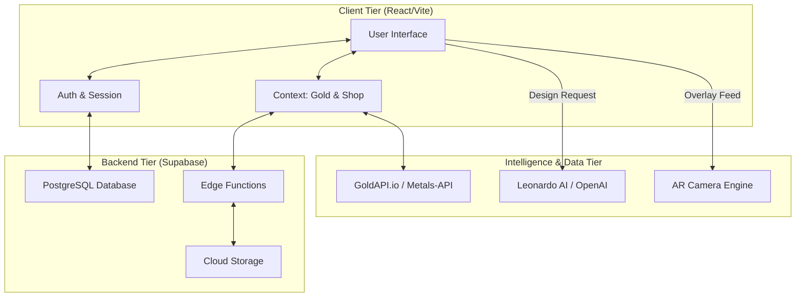
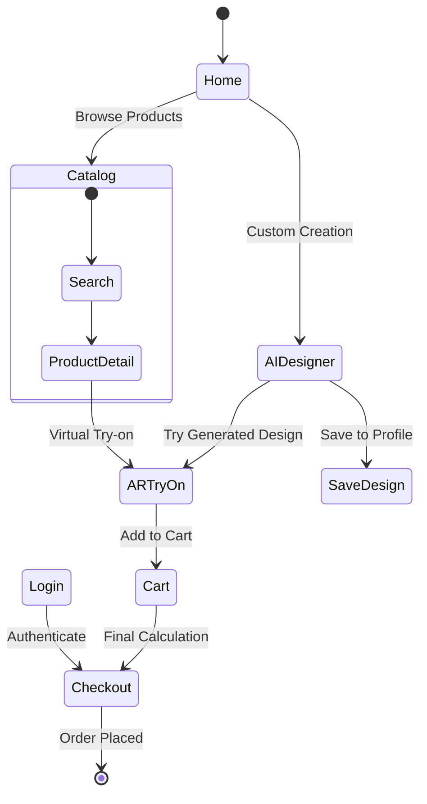

# 💎 ORNAMIS - AI-Driven Jewelry Marketplace
### A Final Project Report

---

**Submitted By:**
1. **Sadaf Fatima** (Roll No: 160522747001)
2. **Mahin Jahaan** (Roll No: 160522747002)
3. **Insherah Tanzeel** (Roll No: 160522747004)

**Department:** 
Artificial Intelligence and Data Science Engineering

**Date:** April 22, 2026

---

## 📄 1. Abstract

**ORNAMIS** is a cutting-edge e-commerce platform designed to bridge the gap between traditional jewelry retail and modern AI-driven consumer expectations. In the era of Data Science, the platform leverages generative AI and real-time market data to provide a personalized, transparent, and interactive shopping experience. The project integrates **Generative AI** for custom design creation, **Augmented Reality (AR)** for virtual product try-on, and a **Dynamic Pricing Engine** that synchronizes with international gold markets. This report details the architecture, implementation, and future scope of the ORNAMIS ecosystem.

---

## 🏢 2. Introduction

The jewelry industry has historically relied on physical interaction and manual price calculations, often leading to consumer anxiety regarding price transparency and product suitability. **ORNAMIS** introduces a digital-first approach where data is used to empower the consumer. As students of **Artificial Intelligence and Data Science**, our focus was to build a system where complex data (live metal rates) and sophisticated models (Image Generation) are brought to a user-friendly web interface.

---

## 🚫 3. Existing System

Traditional jewelry shopping systems suffer from several pain points:
- **Lack of Transparency**: Prices are often static or manually updated, creating discrepancies between showroom rates and market values.
- **Physical Dependency**: Customers must visit stores to "try on" products, which is time-consuming and limits variety.
- **Limited Customization**: Custom designs require long consultations with artisans without knowing the final look.
- **Data Silos**: Product availability across multiple vendors is hard to track in one unified view.

---

## ✨ 4. Proposed System

The proposed **ORNAMIS** system solves these issues through a multi-modular technical architecture:
1.  **AI Design Studio**: Uses the Leonardo AI API to generate photorealistic jewelry designs from user-provided text prompts or sketches, allowing instant visualization of custom ideas.
2.  **AR Virtual Try-On**: A browser-based augmented reality system that uses the camera to overlay jewelry on the user, enabling informed decision-making from home.
3.  **Real-Time Pricing Engine**: A data-driven module that fetches live gold rates (24k/22k/18k) and calculates final prices dynamically using fixed making-charge logic.
4.  **Vendor Aggregation**: A unified marketplace for multiple brands (Palmonas, Giva, Jauhari, etc.) with centralized search and filtering.

---

## 🏗️ 5. System Architecture (Diagram)

The system is built on a **Serverless Architecture** using React for the frontend and Supabase for the backend.

---

## 🔄 6. Flow Chart (User Journey)

The following diagram illustrates the typical user activity flow within the application:

---

## 🏁 7. Conclusion

ORNAMIS successfully demonstrates the application of **AI and Data Science** in the e-commerce domain. By integrating real-time market synchronization and generative design, the platform achieves a level of transparency and interactivity previously unseen in the jewelry market. The project proves that decentralized backend solutions (Supabase) and API-first architectures enable the rapid deployment of complex, data-heavy features with high performance and security.

---

## 🚀 8. Future Enhancement

To further advance the platform as an AI/DS project:
- **3D Neural Rendering**: Moving from 2D overlays to 3D Neural Radiance Fields (NeRF) for more realistic jewelry depth in AR.
- **AI Stylist**: A recommendation engine using computer vision to suggest jewelry based on the user's face shape and attire.
- **Blockchain Integration**: Using NFTs for digital certificates of authenticity for premium gemstones and gold.
- **Predictive Analytics**: Using historical market data to predict future gold price trends for better investment timing.

---

## 📚 9. References

- **Tech Stack**: React 18, TypeScript, Tailwind CSS, Vite.
- **Cloud Backend**: Supabase (PostgreSQL, Edge Functions, Auth).
- **AI Integration**: Leonardo.ai (Diffusion Models), OpenAI GPT-4.
- **Market Data**: GoldAPI.io, Metals-API.
- **UI & Icons**: Framer Motion, Lucide React, Shadcn/UI.

---

### 🖨️ How to Export as PDF:
1.  Open this file in an editor (like VS Code or Obsidian).
2.  Press `Ctrl + Shift + P` and search for "Markdown: Open Preview".
3.  Right-click the preview and select **"Print"** or **"Save as PDF"**.
4.  Alternatively, copy the content into a Word document and save as PDF.
