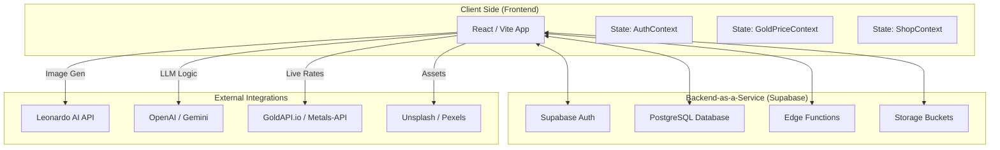
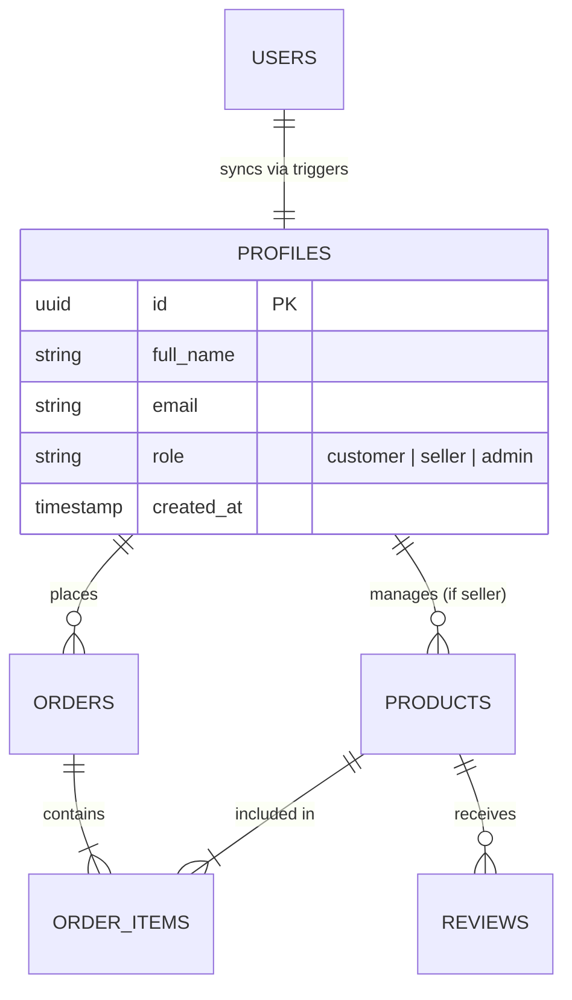
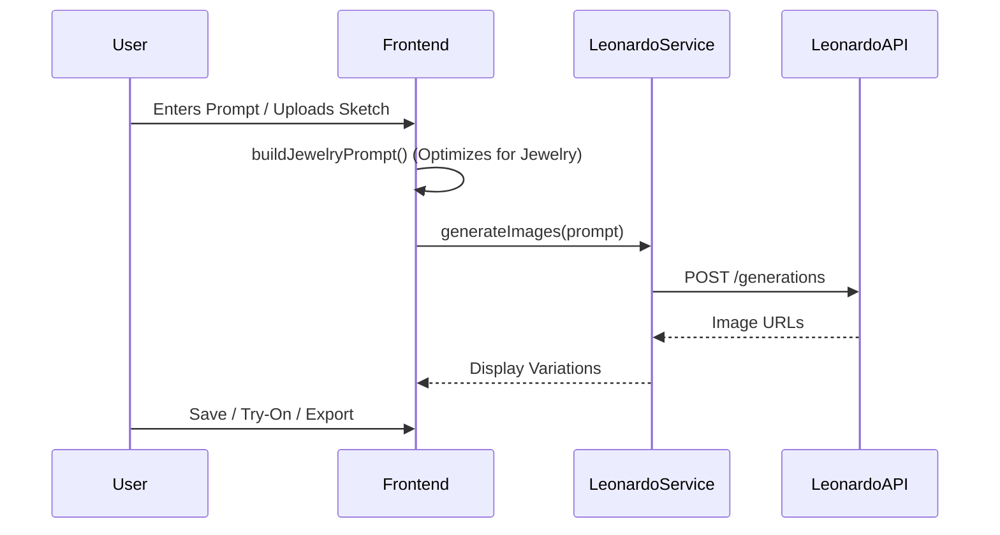

# 🏗️ ORNAMIS - System Architecture Documentation

This document provides a detailed technical overview of the ORNAMIS jewelry marketplace, its internal structure, data flows, and external integrations.

---

## 🔐 1. High-Level System Overview

The ORNAMIS platform follows a modern **Cloud-Native Architecture** with a decoupled frontend, a Managed Backend-as-a-Service (BaaS), and multiple specialized AI/Data microservices.

---

## 🎨 2. Frontend Architecture

### 🛠️ Tech Stack
- **Framework**: React 18+ with TypeScript
- **Build Tool**: Vite (Ultra-fast development & HMR)
- **Styling**: Tailwind CSS v4 (Utility-first styling)
- **Animations**: Motion (Framer Motion) for fluid UI transitions
- **UI Components**: Radix UI + Shadcn UI (Accessible, customizable primitives)
- **Icons**: Lucide React

### 🧠 State Management
We use the **React Context API** for a lightweight yet powerful state management system:

| Context | Responsibility |
|---------|----------------|
| `AuthContext` | User session, profile data, RBAC (Role-Based Access Control) |
| `GoldPriceContext` | Live market rates, metal purity logic, conversion factors |
| `ShopContext` | Shopping cart persistence, wishlist state |

---

## 💾 3. Backend Infrastructure (Supabase)

ORNAMIS leverages **Supabase** for its entire backend infrastructure, ensuring high scalability and security.

### 🛡️ Security Model (RBAC)
The system uses Row-Level Security (RLS) and custom database triggers to manage user roles:
1.  **Customers**: Can browse, design, and purchase. Can only access their own profile/orders.
2.  **Sellers**: Can upload products and view sales analytics.
3.  **Admins**: Full platform oversight, user verification, and product approval.

### 📊 Database Schema (PostgreSQL)
The core schema centers around the `profiles` table, synchronized with `auth.users`:

---

## 🧪 4. Feature Deep Dives

### 🪄 AI Designer Workflow
The AI Designer transforms user prompts, sketches, or reference images into photorealistic jewelry renders.

### 📱 AR Virtual Try-On Logic
A pure client-side AR implementation that avoids heavy server-side processing:
1.  **MediaStream**: Captures live feed via `navigator.mediaDevices.getUserMedia`.
2.  **Canvas Rendering**: Overlays jewelry PNGs onto the video feed.
3.  **Interactive Controls**: Users can scale, reposition, and adjust the opacity of the jewelry in real-time.
4.  **Hardware Acceleration**: Uses CSS transforms and canvas for smooth performance on mobile.

### 💰 Gold Pricing System
The pricing engine calculates product costs dynamically based on the current market.

> [!NOTE]
> **Hierarchy of Truth**:
> Live API (GoldAPI.io) ➔ Fallback API ➔ Demo Mode (Cached/Approximate Rates)

**Calculation Formula**:
`Total Price = (Gold Weight × Live Rate × Purity Factor) + Making Charges + Gemstone Cost + GST(3%)`

---

## 📈 5. Data Flow & Communication

### Authentication Flow
1.  **Sign Up**: User registers ➔ Supabase Auth creates user ➔ PostgreSQL Trigger creates profile ➔ Frontend updates context.
2.  **Session Persistence**: On app mount, `AuthContext` checks `localStorage` and `supabase.auth.getSession()` for a valid token.
3.  **Route Protection**: `ProtectedRoute` wrapper component intercepts unauthenticated navigation attempts to sensitive pages.

---

## 🚀 6. Future Architectural Roadmap
- **3D Rendering**: Upgrade AR to use `Three.js` and `glTF` models for realistic depth.
- **Microservices**: Move heavy AI processing to dedicated Supabase Edge Functions for better performance.
- **Advanced Caching**: Implement `TanStack Query` (React Query) for optimized server-state management.

---

*Documentation maintained by ORNAMIS Engineering Team.*
